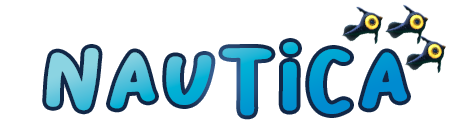

# Nautica 🌀 Melon Loader



Nautica is a modding project on subnautica initially started in 2020, but continued in 2022 with the [MelonLoader](https://github.com/LavaGang/MelonLoader) tool.

## Getting started

**Nautica** is a mod that adds a lot of utility to the development of mods for the game subnautica working with [MelonLoader](https://github.com/LavaGang/MelonLoader).

- Install **MelonLoader** with the [installer](https://github.com/HerpDerpinstine/MelonLoader/releases/latest/download/MelonLoader.Installer.exe) or [manualy](https://github.com/LavaGang/MelonLoader.Installer/blob/master/README.md#how-to-install-re-install-or-update-melonloader) on your game.

- Download the latest or a specific version of nautica.

- Copy the NauticaML.dll library into the mods/ directory of the game.
- Enjoy the game!

## Create a mod with melon loader

Simply follow the [documentation](https://melonwiki.xyz/#/modders/quickstart) of melon loader, and if you want to implement *NauticaML.dll* in your project, you just have to implement the library and add it as a dependency with :

```csharp
[assembly: MelonAdditionalDependencies("NauticaML")]
```

## Issues

- When the steam version of the game is not launched on steam but by the executable, melon loader launches the game twice.